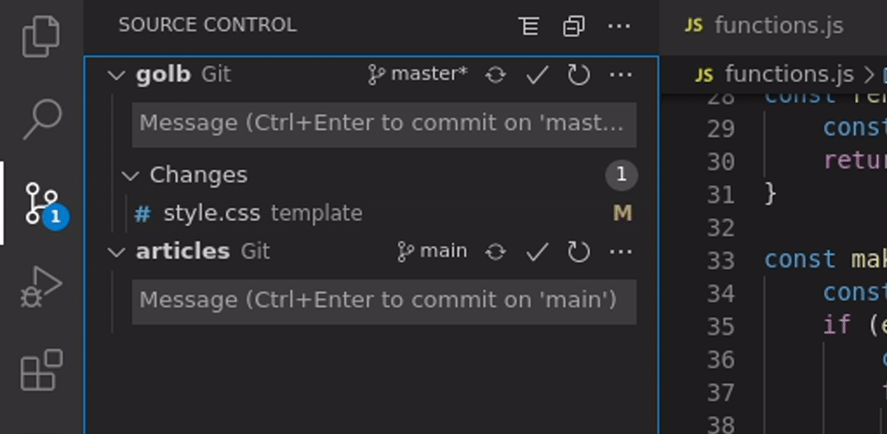

- [GIT on GitHub](https://githubtraining.github.io/training-manual/#/?id=welcome-to-github)
- [GIT Cheat Sheet/](https://training.github.com/downloads/github-git-cheat-sheet/)

## Vocabulary: GIT vs GITHUB

### What is `Git` ?

Git is a free and open source distributed version control system designed to handle everything from small to very large projects with speed and efficiency. ([Wikipedia](https://en.wikipedia.org/wiki/Git))

- <https://git-scm.com/>
- [Vidéo d'explication](https://youtu.be/hwP7WQkmECE)

### What is `GitHub`, `Gitlab` etc ?

GitHub, GitLab, Bitbucket, etc. are web-based hosting services for version control using Git. They provide a web-based graphical interface and access control, as well as several collaboration features such as wikis and basic task management tools.

---

## GIT on Visual Studio Code

- Go to the `Source Control` tab



Translated in commands :

```sh
# git init
# git remote add origin URL_HERE
git add template/style.css # add the file to the staging area
git commit -m "[feature] add css" # commit the changes
git push # push the changes to the remote repository
```

> - for the first push : `git push -u origin main`

## Basic GIT commands

Some GIT commands :

```sh
git init # create a new repository
git clone <url> # clone a repository from the given <url>
git add <file> # add a <file> to the staging area
git commit -m "<message>" # commit the changes
git push # push the changes to the remote repository
git fetch # fetch the changes from the remote repository
git pull # pull the changes from the remote repository

git status # check the status of the repository
git log # view the commit history

git branch # list all branches
git switch <branch> # switch to a <branch>
git checkout <branch> # switch to a <branch>
git merge <branch> # merge a <branch> into the current branch
git reset --soft HEAD~1 # remove the last commit
```

## git bisect

git bisect is a command that helps you find the commit that introduced a bug by performing a binary search through the commit history. It allows you to quickly narrow down the range of commits to identify the specific commit that caused the issue.

```sh
git bisect start
git bisect bad # mark the current commit as bad
git bisect good <commit> # mark a known good commit
# git will checkout a commit in the middle of the range
# test the code
git bisect good # if the commit is good
# or
git bisect bad # if the commit is bad
# repeat the testing process until the bad commit is found
git bisect reset # reset to the original HEAD
```
