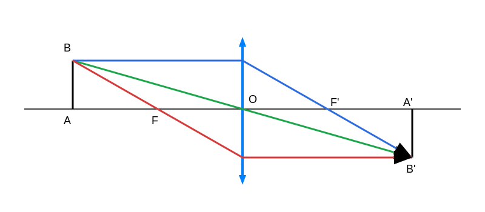
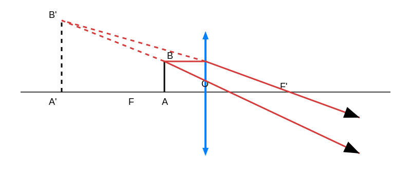
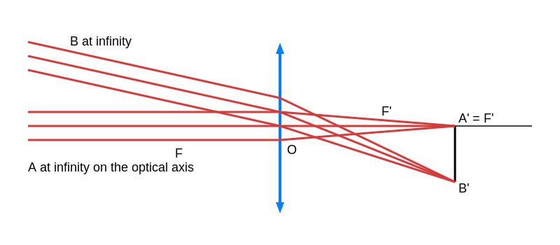

## Lens

### Object located at a finite distance from the lens

The object point A is to the left of F.
B′ is located at the intersection of the rays emerging from the lens: the image is real.

The object point A is to the right of F.
B′ is located at the intersection of the extensions of the rays emerging from the lens: the image is virtual.

### Object located at infinity

The image is real and located in the image focal plane.

- B at infinity
- A at infinity on the optical axis

